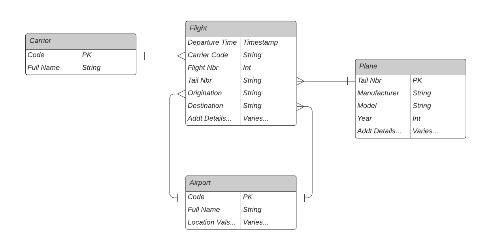

# FAA Dataset Information

This dataset is a mudged & modified example of the kind of information available for download from the USA's Federal Aviation Administration.  

Its RAW format is CSV.

## Data Location

Ultimately, this data comes from the [FAA Data Catalog](https://catalog.data.faa.gov/dataset), but the curated dataset being used can be downloaded from my personal Dropbox account -- [faa-data.zip](https://www.dropbox.com/s/3zmfmarszouz4vd/faa-data.zip?dl=0).

## The Schema

Here is an ERD of the tables (files) and their relationships with each other.

TODO: CREATE AND SAVE ERD FOR THIS PAGE

### The Files

The section provides a data dictionary of each of the main files that make up this FAA data.

#### flights.csv

| Field         | Index | Example Data |
| ------------- |:-----:| -----:|
| Month         | 0     | 1 |
| DayOfMonth    | 1     | 3 |
| DayOfWeek     | 2     | 4 |
| DepTime       | 3     | 1738 |
| ArrTime       | 4     | 1841 |
| UniqueCarrier | 5     | WN |
| FlightNum     | 6     | 3948 |
| TailNum       | 7     | N467WN |
| ElapsedTime   | 8     | 63 |
| AirTime       | 9     | 49 |
| ArrDelay      | 10    | 1 |
| DepDelay      | 11    | 8 |
| Origin        | 12    | JAX |
| Dest          | 13    | FLL |
| Distance      | 14    | 318 |
| TaxiIn        | 15    | 6 |
| TaxiOut       | 16    | 8 |
| Cancelled     | 17    | 0 |
| CancellationCode | 18 |  |
| Diverted      | 19    | 0 |

#### carriers.csv

| Field         | Index | Example Data |
| ------------- |:-----:| -----:|
| Code          | 0     | WN |
| Description   | 1     | Southwest |

#### airports.csv

| Field         | Index | Example Data |
| ------------- |:-----:| -----:|
| AirportCode   | 0     | 00M |
| Airport       | 1     | Thigpen |
| City          | 2     | Bay Springs |
| State         | 3     | MS |
| Country       | 4     | USA |
| Lat           | 5     | 31.95376472 |
| Long          | 6     | -89.23450472 |

#### plane-data.csv

| Field         | Index | Example Data |
| ------------- |:-----:| -----:|
| Tailnum       | 0     | N10156 |
| Type          | 1     | Corporation |
| Manufacturer  | 2     | EMBRAER |
| Issue_date    | 3     | 02/13/2004 |
| Model         | 4     | EMB-145XR |
| Status        | 5     | Valid |
| Aircraft_type | 6     | Fixed Wing Multi-Engine |
| Engine_type   | 7     | Turbo-Fan |
| Year          | 8     | 2004 |
